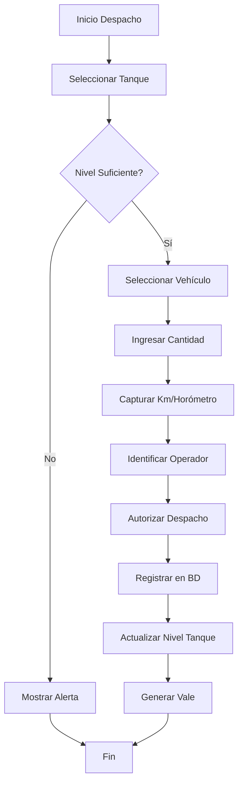

# Plan de Implementación - Módulo de Control de Diésel

## Descripción General

Este documento describe el plan para integrar el **Módulo de Control de Diésel** al sistema DemoZ01. El módulo permitirá gestionar el despacho, consumo y seguimiento de combustible diésel para vehículos y maquinaria.

---

## Análisis del Diagrama (DG.jpeg)

El diagrama muestra el flujo del sistema de control de diésel con los siguientes componentes principales:

| Componente | Descripción |
|------------|-------------|
| **Tanque Principal** | Almacenamiento central de diésel |
| **Bomba/Dispensador** | Sistema de despacho de combustible |
| **Sensor de Flujo** | Medición del caudal dispensado |
| **Registro** | Captura de despachos (operador, vehículo, cantidad) |
| **Reportes** | Generación de informes de consumo |

---

## Análisis de Boleta Física Actual (boleta01.jpeg)

Actualmente el proceso es **100% manual** con boletas físicas. El sistema debe digitalizar completamente este flujo.

### Campos Identificados en la Boleta

| Campo | Tipo de Dato | Validación |
|-------|--------------|------------|
| **Nº de Boleta** | Correlativo automático | Generado por sistema |
| **Fecha** | Date | Fecha actual por defecto |
| **Hora** | Time | Hora actual por defecto |
| **Placa/Código** | Select | Lista de vehículos registrados |
| **Tipo de Unidad** | Enum | Vehículo, Maquinaria, Generador, Otro |
| **Km/Horómetro** | Number | Mayor al último registro |
| **Litros Despachados** | Decimal | No exceder nivel de tanque |
| **Operador** | Select | Personal autorizado |
| **Conductor/Solicitante** | Select/Text | Personal o externo |
| **Autorizado por** | Select | Personal con permiso |
| **Tanque de Origen** | Select | Tanque con nivel suficiente |
| **Observaciones** | Text | Opcional |
| **Firma Digital** | Signature | Opcional (Fase futura) |

### Beneficios de la Digitalización

```
┌─────────────────────────────────────────────────────────────────┐
│                    PROCESO ACTUAL (Manual)                      │
├─────────────────────────────────────────────────────────────────┤
│ ❌ Boletas físicas que se pueden perder                         │
│ ❌ Errores de escritura y cálculo                               │
│ ❌ Difícil consolidar reportes                                  │
│ ❌ No hay alertas de nivel bajo                                 │
│ ❌ No se puede auditar fácilmente                               │
└─────────────────────────────────────────────────────────────────┘
                              ▼
┌─────────────────────────────────────────────────────────────────┐
│                   PROCESO DIGITAL (Nuevo)                       │
├─────────────────────────────────────────────────────────────────┤
│ ✅ Registro digital con respaldo automático                     │
│ ✅ Validaciones en tiempo real                                  │
│ ✅ Reportes automáticos instantáneos                            │
│ ✅ Alertas de nivel bajo por email/notificación                 │
│ ✅ Trazabilidad completa y auditoría                            │
│ ✅ Impresión de boleta digital si se requiere                   │
└─────────────────────────────────────────────────────────────────┘
```

### Mockup del Formulario de Despacho Digital

```
┌──────────────────────────────────────────────────────────────────┐
│  📋 REGISTRO DE DESPACHO DE COMBUSTIBLE          Boleta #: 00123 │
├──────────────────────────────────────────────────────────────────┤
│                                                                  │
│  Fecha: [26/12/2024]     Hora: [14:45]                          │
│                                                                  │
│  ┌─ Tanque de Origen ──────────────────────────────────────────┐│
│  │ [▼ Tanque Principal - 5,420 Lts disponibles              ]  ││
│  └─────────────────────────────────────────────────────────────┘│
│                                                                  │
│  ┌─ Vehículo/Maquinaria ───────────────────────────────────────┐│
│  │ [▼ ABC-123 - Toyota Hilux 2020                           ]  ││
│  └─────────────────────────────────────────────────────────────┘│
│                                                                  │
│  Kilometraje Actual: [  125,430  ] km                           │
│  (Último registro: 125,380 km)                                   │
│                                                                  │
│  Cantidad a Despachar: [    50    ] litros                      │
│                                                                  │
│  ┌─ Personal ──────────────────────────────────────────────────┐│
│  │ Conductor:    [▼ Juan Pérez                              ]  ││
│  │ Operador:     [▼ María García                            ]  ││
│  │ Autorizado:   [▼ Carlos López                            ]  ││
│  └─────────────────────────────────────────────────────────────┘│
│                                                                  │
│  Observaciones:                                                  │
│  ┌─────────────────────────────────────────────────────────────┐│
│  │ Viaje a zona norte                                          ││
│  └─────────────────────────────────────────────────────────────┘│
│                                                                  │
│         [ 🖨️ Imprimir ]    [ ✅ Registrar Despacho ]            │
│                                                                  │
└──────────────────────────────────────────────────────────────────┘
```

---

## Estructura del Módulo

### 1. Entidades de Base de Datos

#### Tablas Principales

```
┌─────────────────────────────────────────────────────────────────┐
│                         TANQUES                                  │
├─────────────────────────────────────────────────────────────────┤
│ id, nombre, tipo (ESTATICO/MOVIL), capacidad_litros,            │
│ nivel_actual, ubicacion_fija, nivel_minimo_alerta, estado,      │
│ vehiculo_asignado_id (para móviles), placa_cisterna,            │
│ responsable_id, created_at, updated_at                          │
└─────────────────────────────────────────────────────────────────┘

💡 TIPOS DE TANQUES:
   • ESTÁTICO: Tanques fijos en planta/base
   • MÓVIL: Cisternas que se desplazan a campo/obra
                              │
                              ▼
┌─────────────────────────────────────────────────────────────────┐
│                     RECARGAS_TANQUE                              │
├─────────────────────────────────────────────────────────────────┤
│ id, tanque_id, cantidad_litros, proveedor, numero_factura,      │
│ costo_total, costo_por_litro, fecha_recarga, usuario_id,        │
│ observaciones, created_at, updated_at                           │
└─────────────────────────────────────────────────────────────────┘

┌─────────────────────────────────────────────────────────────────┐
│                       VEHICULOS                                  │
├─────────────────────────────────────────────────────────────────┤
│ id, placa, tipo (vehiculo/maquinaria), marca, modelo, año,      │
│ capacidad_tanque, consumo_promedio, kilometraje_actual,         │
│ departamento_id, responsable_id, estado, created_at, updated_at │
└─────────────────────────────────────────────────────────────────┘
                              │
                              ▼
┌─────────────────────────────────────────────────────────────────┐
│                      DESPACHOS                                   │
├─────────────────────────────────────────────────────────────────┤
│ id, tanque_id, vehiculo_id, operador_id, autorizador_id,        │
│ cantidad_litros, kilometraje, horómetro, fecha_despacho,        │
│ numero_vale, lugar_despacho (PLANTA/CAMPO), observaciones       │
└─────────────────────────────────────────────────────────────────┘

┌─────────────────────────────────────────────────────────────────┐
│                    TRANSFERENCIAS                                │
├─────────────────────────────────────────────────────────────────┤
│ id, tanque_origen_id, tanque_destino_id, cantidad_litros,       │
│ fecha_transferencia, operador_id, observaciones                 │
└─────────────────────────────────────────────────────────────────┘

💡 FLUJO COMPLETO DEL COMBUSTIBLE:

┌─────────────┐    RECARGA     ┌─────────────┐
│ PROVEEDOR   │ ─────────────► │  🏭 TANQUE  │
│ (Compra)    │   (Factura)    │  ESTÁTICO   │
└─────────────┘                └──────┬──────┘
                                      │
                    ┌─────────────────┼─────────────────┐
                    │                 │                 │
                    ▼                 │                 ▼
             TRANSFERENCIA            │            DESPACHO
           (Carga cisterna)           │          (En planta)
                    │                 │                 │
                    ▼                 │                 ▼
             ┌─────────────┐          │          ┌─────────────┐
             │  🚚 TANQUE  │          │          │  🚗 VEHÍCULO │
             │    MÓVIL    │          │          │  (planta)   │
             │ (cisterna)  │          │          └─────────────┘
             └──────┬──────┘          │
                    │                 │
                    ▼                 │
               DESPACHO               │
             (En campo)               │
                    │                 │
                    ▼                 │
             ┌─────────────┐          │
             │  🚗 VEHÍCULO │          │
             │  (campo)    │          │
             └─────────────┘          │
```

---

### 2. Funcionalidades por Pantalla

#### 2.1 Dashboard de Combustible
- **Vista general** de niveles de tanques (gráfico de barras/gauge)
- **Alertas** de nivel bajo
- **Consumo del día/semana/mes**
- **Top 5** vehículos con mayor consumo
- **Acceso rápido** a despacho

#### 2.2 Gestión de Tanques
- CRUD de tanques de almacenamiento
- Historial de recargas
- Alertas configurables de nivel mínimo
- Gráfico de evolución de inventario

#### 2.3 Gestión de Vehículos/Maquinaria
- CRUD de vehículos y maquinaria
- Asignación a departamentos/responsables
- Historial de consumo por vehículo
- Cálculo de rendimiento (km/litro)

#### 2.4 Registro de Despachos
- Formulario de despacho con validaciones
- Selección de tanque y vehículo
- Captura de kilometraje/horómetro
- Generación automática de número de vale
- Firma digital del operador (opcional)

#### 2.5 Reportes
- **Consumo por vehículo** (período configurable)
- **Consumo por departamento**
- **Historial de recargas**
- **Rendimiento de vehículos**
- **Exportación a Excel/PDF**

---

### 3. Arquitectura Técnica

#### Backend (Laravel)

```
api_laravel/
├── app/
│   ├── Http/
│   │   └── Controllers/
│   │       └── Diesel/
│   │           ├── TanqueController.php
│   │           ├── VehiculoController.php
│   │           ├── DespachoController.php
│   │           ├── RecargaController.php
│   │           └── ReporteDieselController.php
│   ├── Models/
│   │   ├── Tanque.php
│   │   ├── Vehiculo.php
│   │   ├── Despacho.php
│   │   └── RecargaTanque.php
│   └── Services/
│       └── DieselService.php
├── database/
│   └── migrations/
│       ├── create_tanques_table.php
│       ├── create_vehiculos_table.php
│       ├── create_despachos_table.php
│       └── create_recargas_tanque_table.php
└── routes/
    └── api.php (nuevas rutas)
```

#### Frontend (React)

```
Zdemo01/src/
├── pages/
│   └── diesel/
│       ├── DieselDashboardPage.jsx
│       ├── TanquesPage.jsx
│       ├── VehiculosPage.jsx
│       ├── DespachosPage.jsx
│       └── ReportesDieselPage.jsx
├── components/
│   └── diesel/
│       ├── TanqueGauge.jsx
│       ├── DespachoForm.jsx
│       ├── VehiculoCard.jsx
│       └── ConsumoChart.jsx
└── services/
    └── dieselService.js
```

---

## Fases de Implementación

### Fase 1: Base de Datos y Backend Básico
**Duración estimada: 2-3 días**

- [ ] Crear migraciones para las tablas
- [ ] Crear modelos con relaciones
- [ ] Implementar controladores CRUD básicos
- [ ] Agregar rutas API
- [ ] Crear seeders con datos de prueba

### Fase 2: Frontend - Páginas Principales
**Duración estimada: 3-4 días**

- [ ] Crear páginas de gestión de Tanques
- [ ] Crear páginas de gestión de Vehículos
- [ ] Implementar formulario de Despacho
- [ ] Integrar con componentes del Design System existente

### Fase 3: Dashboard y Visualización
**Duración estimada: 2-3 días**

- [ ] Crear Dashboard de combustible
- [ ] Implementar componente TanqueGauge
- [ ] Crear gráficos de consumo
- [ ] Implementar alertas visuales

### Fase 4: Reportes
**Duración estimada: 2 días**

- [ ] Implementar generación de reportes
- [ ] Exportación a Excel/PDF
- [ ] Filtros por período/vehículo/departamento

### Fase 5: Integración y Permisos
**Duración estimada: 1-2 días**

- [ ] Agregar menús al sistema de navegación
- [ ] Configurar permisos con SecuredButton
- [ ] Pruebas de integración

---

## Endpoints API Propuestos

| Método | Endpoint | Descripción |
|--------|----------|-------------|
| GET | `/api/diesel/tanques` | Listar tanques |
| POST | `/api/diesel/tanques` | Crear tanque |
| PUT | `/api/diesel/tanques/{id}` | Actualizar tanque |
| DELETE | `/api/diesel/tanques/{id}` | Eliminar tanque |
| POST | `/api/diesel/tanques/{id}/recarga` | Registrar recarga |
| GET | `/api/diesel/vehiculos` | Listar vehículos |
| POST | `/api/diesel/vehiculos` | Crear vehículo |
| PUT | `/api/diesel/vehiculos/{id}` | Actualizar vehículo |
| DELETE | `/api/diesel/vehiculos/{id}` | Eliminar vehículo |
| GET | `/api/diesel/despachos` | Listar despachos |
| POST | `/api/diesel/despachos` | Registrar despacho |
| GET | `/api/diesel/reportes/consumo` | Reporte de consumo |
| GET | `/api/diesel/reportes/rendimiento` | Reporte de rendimiento |
| GET | `/api/diesel/dashboard` | Datos del dashboard |

---

## Consideraciones Adicionales

### Seguridad
- Todos los endpoints requieren autenticación
- Permisos granulares por rol (ver, crear, editar, eliminar)
- Registro de auditoría para despachos

### Validaciones de Negocio
- No permitir despachos que excedan el nivel del tanque
- Validar kilometraje/horómetro mayor al último registro
- Alertas automáticas cuando nivel < mínimo configurado

### Integración con Módulos Existentes
- **Personal**: Operadores y autorizadores
- **Configuración**: Parametrización de alertas
- **Seguridad**: Control de acceso

---

## Diagrama de Flujo del Despacho



---

## Próximos Pasos

1. **Revisar y aprobar** este plan
2. **Definir prioridades** - ¿Qué funcionalidades son críticas para el MVP?
3. **Confirmar estructura de datos** - ¿Hay campos adicionales necesarios?
4. **Iniciar Fase 1** - Base de datos y backend

---

> **Nota:** Este plan puede ajustarse según los requerimientos específicos del negocio y la infraestructura existente.

*Documento creado: 26 de Diciembre, 2025*
