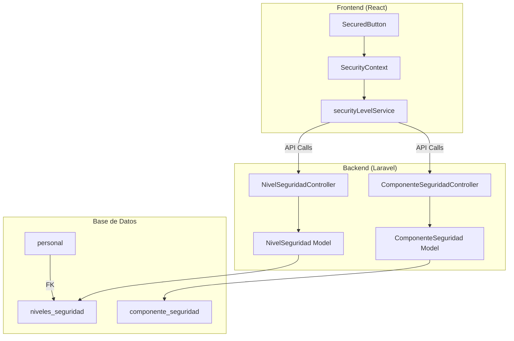

# Sistema de Botones con Control de Seguridad (SecuredButton)

## Descripción General

El sistema `SecuredButton` permite controlar el acceso a botones/acciones específicas de la aplicación basándose en **grupos de seguridad**. Los usuarios SuperAdmin pueden configurar qué grupo de seguridad se requiere para cada botón directamente desde la interfaz.

## Arquitectura del Sistema



---

## 1. Base de Datos (Migraciones)

### Migración: `create_security_levels_tables.php`

```php
<?php

use Illuminate\Database\Migrations\Migration;
use Illuminate\Database\Schema\Blueprint;
use Illuminate\Support\Facades\Schema;

return new class extends Migration
{
    public function up(): void
    {
        // 1. Tabla de Niveles/Grupos de Seguridad
        Schema::create('niveles_seguridad', function (Blueprint $table) {
            $table->id();
            $table->string('nombre', 50)->unique(); // "Administración", "Ventas", "RRHH"
            $table->string('color', 7)->default('#6b7280'); // Hex color
            $table->text('descripcion')->nullable();
            $table->boolean('is_active')->default(true);
            $table->timestamps();
        });

        // 2. Tabla de Componentes protegidos
        Schema::create('componente_seguridad', function (Blueprint $table) {
            $table->id();
            $table->string('componente_id', 100);   // ID único del botón: "usuarios.crear"
            $table->string('pagina', 100);          // Ruta: "/sistemas/usuarios"
            $table->string('descripcion')->nullable();
            $table->foreignId('nivel_seguridad_id')->constrained('niveles_seguridad')->cascadeOnDelete();
            $table->timestamps();

            $table->unique('componente_id'); // Cada componente solo tiene un nivel asignado
        });

        // 3. Agregar FK en tabla personal (empleados)
        if (Schema::hasTable('personal')) {
            Schema::table('personal', function (Blueprint $table) {
                $table->foreignId('nivel_seguridad_id')
                      ->nullable()
                      ->after('cargo_id')
                      ->constrained('niveles_seguridad')
                      ->nullOnDelete();
            });
        }
    }

    public function down(): void
    {
        if (Schema::hasColumn('personal', 'nivel_seguridad_id')) {
            Schema::table('personal', function (Blueprint $table) {
                $table->dropForeign(['nivel_seguridad_id']);
                $table->dropColumn('nivel_seguridad_id');
            });
        }
        Schema::dropIfExists('componente_seguridad');
        Schema::dropIfExists('niveles_seguridad');
    }
};
```

> [!IMPORTANT]
> La tabla `personal` es donde se guardan los empleados. Debe tener una columna `nivel_seguridad_id` que indique a qué grupo pertenece cada empleado.

---

## 2. Modelos Laravel

### `NivelSeguridad.php`

```php
<?php

namespace App\Models;

use Illuminate\Database\Eloquent\Model;
use Illuminate\Database\Eloquent\Relations\HasMany;

class NivelSeguridad extends Model
{
    protected $table = 'niveles_seguridad';

    protected $fillable = [
        'nombre',
        'color',
        'descripcion',
        'is_active',
    ];

    protected $casts = [
        'is_active' => 'boolean',
    ];

    // Relación con empleados
    public function personal(): HasMany
    {
        return $this->hasMany(Persona::class, 'nivel_seguridad_id');
    }

    // Relación con componentes protegidos
    public function componentes(): HasMany
    {
        return $this->hasMany(ComponenteSeguridad::class, 'nivel_seguridad_id');
    }

    // Scope para obtener solo niveles activos
    public function scopeActivos($query)
    {
        return $query->where('is_active', true);
    }
}
```

### `ComponenteSeguridad.php`

```php
<?php

namespace App\Models;

use Illuminate\Database\Eloquent\Model;
use Illuminate\Database\Eloquent\Relations\BelongsTo;

class ComponenteSeguridad extends Model
{
    protected $table = 'componente_seguridad';

    protected $fillable = [
        'componente_id',
        'pagina',
        'descripcion',
        'nivel_seguridad_id',
    ];

    public function nivelSeguridad(): BelongsTo
    {
        return $this->belongsTo(NivelSeguridad::class, 'nivel_seguridad_id');
    }
}
```

---

## 3. Controladores Laravel

### `NivelSeguridadController.php`

```php
<?php

namespace App\Http\Controllers;

use App\Models\NivelSeguridad;
use App\Models\Persona;
use Illuminate\Http\Request;
use Illuminate\Http\JsonResponse;

class NivelSeguridadController extends Controller
{
    // Listar todos los niveles
    public function index(): JsonResponse
    {
        $niveles = NivelSeguridad::withCount(['personal', 'componentes'])
            ->orderBy('id')
            ->get()
            ->map(function ($nivel) {
                return [
                    'id' => $nivel->id,
                    'nombre' => $nivel->nombre,
                    'color' => $nivel->color,
                    'descripcion' => $nivel->descripcion,
                    'is_active' => $nivel->is_active,
                    'personal_count' => $nivel->personal_count,
                    'componentes_count' => $nivel->componentes_count,
                ];
            });

        return response()->json(['success' => true, 'data' => $niveles]);
    }

    // Obtener niveles activos (para selects)
    public function activos(): JsonResponse
    {
        $niveles = NivelSeguridad::activos()
            ->orderBy('id')
            ->get(['id', 'nombre', 'color']);

        return response()->json([
            'success' => true,
            'data' => $niveles->map(fn($n) => [
                'id' => $n->id,
                'nombre' => $n->nombre,
                'color' => $n->color,
            ])
        ]);
    }

    // CRUD estándar: store, update, destroy
    public function store(Request $request): JsonResponse { /* ... */ }
    public function update(Request $request, $id): JsonResponse { /* ... */ }
    public function destroy($id): JsonResponse { /* ... */ }

    // Gestión de miembros
    public function miembros($id): JsonResponse { /* ... */ }
    public function addMiembro(Request $request, $id): JsonResponse { /* ... */ }
    public function removeMiembro($id, $personaId): JsonResponse { /* ... */ }
    public function empleadosDisponibles($id): JsonResponse { /* ... */ }
}
```

### `ComponenteSeguridadController.php`

```php
<?php

namespace App\Http\Controllers;

use App\Models\ComponenteSeguridad;
use Illuminate\Http\Request;
use Illuminate\Http\JsonResponse;

class ComponenteSeguridadController extends Controller
{
    // Obtener todos los componentes protegidos
    public function index(): JsonResponse
    {
        $componentes = ComponenteSeguridad::with('nivelSeguridad:id,nombre,color')->get();
        return response()->json(['success' => true, 'data' => $componentes]);
    }

    // Asignar/actualizar nivel a un componente (upsert)
    public function upsert(Request $request): JsonResponse
    {
        $validated = $request->validate([
            'componente_id' => 'required|string|max:100',
            'pagina' => 'required|string|max:100',
            'descripcion' => 'nullable|string',
            'nivel_seguridad_id' => 'required|exists:niveles_seguridad,id',
        ]);

        $componente = ComponenteSeguridad::updateOrCreate(
            ['componente_id' => $validated['componente_id']],
            $validated
        );

        return response()->json([
            'success' => true,
            'message' => 'Nivel de seguridad asignado al componente',
            'data' => $componente->load('nivelSeguridad:id,nombre,color')
        ]);
    }

    // Eliminar protección de un componente
    public function destroy(string $componenteId): JsonResponse
    {
        $deleted = ComponenteSeguridad::where('componente_id', $componenteId)->delete();
        return response()->json([
            'success' => $deleted > 0,
            'message' => $deleted > 0 ? 'Componente liberado' : 'Componente no encontrado'
        ]);
    }
}
```

---

## 4. Rutas API (Laravel)

```php
// routes/api.php

Route::middleware(['auth:sanctum'])->group(function () {
    // ... otras rutas

    // Niveles de Seguridad
    Route::get('/niveles-seguridad/activos', [NivelSeguridadController::class, 'activos']);
    Route::get('/niveles-seguridad/{id}/miembros', [NivelSeguridadController::class, 'miembros']);
    Route::get('/niveles-seguridad/{id}/empleados-disponibles', [NivelSeguridadController::class, 'empleadosDisponibles']);
    Route::post('/niveles-seguridad/{id}/miembros', [NivelSeguridadController::class, 'addMiembro']);
    Route::delete('/niveles-seguridad/{id}/miembros/{personaId}', [NivelSeguridadController::class, 'removeMiembro']);
    Route::apiResource('niveles-seguridad', NivelSeguridadController::class);

    // Componentes con Seguridad
    Route::get('/componentes-seguridad', [ComponenteSeguridadController::class, 'index']);
    Route::post('/componentes-seguridad', [ComponenteSeguridadController::class, 'upsert']);
    Route::delete('/componentes-seguridad/{componenteId}', [ComponenteSeguridadController::class, 'destroy']);
});
```

---

## 5. Frontend - Servicio de Seguridad

### `securityLevelService.js`

```javascript
import { authFetch } from './authService';

// Obtener todos los niveles de seguridad
export async function fetchNiveles() {
    const response = await authFetch('/niveles-seguridad');
    const data = await response.json();
    return { success: response.ok, data: data.data || [] };
}

// Obtener niveles activos (para selects)
export async function fetchNivelesActivos() {
    const response = await authFetch('/niveles-seguridad/activos');
    const data = await response.json();
    return { success: response.ok, data: data.data || [] };
}

// Obtener todos los componentes protegidos
export async function fetchComponentesSecurity() {
    const response = await authFetch('/componentes-seguridad');
    const data = await response.json();
    return { success: response.ok, data: data.data || [] };
}

// Asignar nivel a un componente
export async function setComponenteSecurity(componenteData) {
    const response = await authFetch('/componentes-seguridad', {
        method: 'POST',
        headers: { 'Content-Type': 'application/json' },
        body: JSON.stringify(componenteData),
    });
    const data = await response.json();
    return { success: response.ok, data: data.data };
}

// Eliminar protección de un componente
export async function removeComponenteSecurity(componenteId) {
    const response = await authFetch(`/componentes-seguridad/${componenteId}`, {
        method: 'DELETE',
    });
    const data = await response.json();
    return { success: response.ok };
}

// CRUD de niveles y gestión de miembros...
export async function createNivel(nivelData) { /* ... */ }
export async function updateNivel(id, nivelData) { /* ... */ }
export async function deleteNivel(id) { /* ... */ }
export async function fetchMiembros(nivelId) { /* ... */ }
export async function addMiembro(nivelId, personaIds) { /* ... */ }
export async function removeMiembro(nivelId, personaId) { /* ... */ }
```

---

## 6. Frontend - Contexto de Seguridad

### `SecurityContext.jsx`

```jsx
import React, { createContext, useContext, useState, useEffect, useCallback } from 'react';
import { fetchComponentesSecurity, fetchNivelesActivos } from '../services/securityLevelService';

const SecurityContext = createContext(null);

export function SecurityProvider({ children, user }) {
    const [componentes, setComponentes] = useState({});  // { componenteId: nivelRequridoId }
    const [niveles, setNiveles] = useState([]);
    const [userLevel, setUserLevel] = useState(null);
    const [isSuperAdmin, setIsSuperAdmin] = useState(false);
    const [loading, setLoading] = useState(true);

    // Cargar datos al montar
    const loadSecurityData = useCallback(async () => {
        const [componentesRes, nivelesRes] = await Promise.all([
            fetchComponentesSecurity(),
            fetchNivelesActivos()
        ]);

        if (componentesRes.success) {
            const componentesMap = {};
            (componentesRes.data || []).forEach(c => {
                componentesMap[c.componente_id] = c.nivel_seguridad_id;
            });
            setComponentes(componentesMap);
        }

        if (nivelesRes.success) {
            setNiveles(nivelesRes.data || []);
        }
        
        setLoading(false);
    }, []);

    useEffect(() => { loadSecurityData(); }, [loadSecurityData]);

    // Actualizar nivel del usuario
    useEffect(() => {
        if (user) {
            // El usuario tiene un grupo asignado via personal.nivel_seguridad_id
            const nivelId = user.personal?.nivel_seguridad?.id || user.personal?.nivel_seguridad_id;
            setUserLevel(nivelId);

            // Verificar si es SuperAdmin
            const roles = Array.isArray(user.roles) ? user.roles : [];
            const hasSuperAdminRole = roles.some(role => {
                const slug = (typeof role === 'string' ? role : role.slug || '').toLowerCase();
                return slug === 'superadmin' || slug === 'super-admin';
            });
            setIsSuperAdmin(hasSuperAdminRole || user.is_superadmin);
        }
    }, [user]);

    // Verificar si el usuario puede acceder a un componente
    const canAccess = useCallback((componenteId) => {
        if (isSuperAdmin) return true;  // SuperAdmin siempre tiene acceso
        
        const nivelRequeridoId = componentes[componenteId];
        if (!nivelRequeridoId) return true;  // Sin protección = público
        
        return userLevel === nivelRequeridoId;  // Comparación directa de IDs
    }, [componentes, userLevel, isSuperAdmin]);

    // Obtener nivel requerido para un componente
    const getRequiredLevel = useCallback((componenteId) => {
        return componentes[componenteId];
    }, [componentes]);

    // Recargar componentes (después de cambios)
    const refreshComponents = useCallback(async () => {
        const componentesRes = await fetchComponentesSecurity();
        if (componentesRes.success) {
            const componentesMap = {};
            (componentesRes.data || []).forEach(c => {
                componentesMap[c.componente_id] = c.nivel_seguridad_id;
            });
            setComponentes(componentesMap);
        }
    }, []);

    const value = {
        canAccess,
        getRequiredLevel,
        isSuperAdmin,
        userLevel,
        niveles,
        componentes,
        refreshComponents,
        loading,
    };

    return (
        <SecurityContext.Provider value={value}>
            {children}
        </SecurityContext.Provider>
    );
}

export function useSecurity() {
    const context = useContext(SecurityContext);
    if (!context) {
        // Sin provider, todo permitido
        return {
            canAccess: () => true,
            getRequiredLevel: () => undefined,
            isSuperAdmin: false,
            userLevel: null,
            niveles: [],
            componentes: {},
            refreshComponents: async () => {},
            loading: false,
        };
    }
    return context;
}
```

---

## 7. Componente SecuredButton

### `SecuredButton.jsx`

```jsx
import React, { useState, useMemo } from 'react';
import { Settings, Shield, Check, Unlock, Search } from 'lucide-react';
import { useSecurity } from '../core/SecurityContext';
import { setComponenteSecurity, removeComponenteSecurity } from '../services/securityLevelService';
import { DSButton } from './DSButton';
import { DSModal, DSModalSection } from '../ds-overlays';
import './SecuredButton.css';

/**
 * SecuredButton - Botón con control de seguridad por niveles
 * 
 * @param {string} securityId - ID único del botón (ej: "usuarios.crear")
 * @param {string} securityPage - Página donde está el botón
 * @param {string} securityDesc - Descripción del botón (para admin)
 * @param {boolean} showConfigButton - Mostrar botón config para admin
 * @param {React.ReactNode} children - Contenido del botón
 * @param {...props} buttonProps - Props adicionales para DSButton
 */
export function SecuredButton({
    securityId,
    securityPage,
    securityDesc,
    showConfigButton = true,
    children,
    ...buttonProps
}) {
    const { canAccess, isSuperAdmin, niveles, refreshComponents, getRequiredLevel } = useSecurity();
    const [showConfig, setShowConfig] = useState(false);
    const [saving, setSaving] = useState(false);
    const [searchTerm, setSearchTerm] = useState('');

    // Filtrar niveles por búsqueda
    const filteredNiveles = useMemo(() => {
        if (!searchTerm.trim()) return niveles;
        const term = searchTerm.toLowerCase();
        return niveles.filter(n => n.nombre?.toLowerCase().includes(term));
    }, [niveles, searchTerm]);

    // Si no tiene securityId, actúa como botón normal
    if (!securityId) {
        return <DSButton {...buttonProps}>{children}</DSButton>;
    }

    // Verificar acceso
    const hasAccess = canAccess(securityId);
    const requiredLevelId = getRequiredLevel(securityId);
    const currentNivel = niveles.find(n => n.id === requiredLevelId);

    // Bloqueado si: tiene nivel asignado Y el usuario no tiene acceso
    const isBlocked = requiredLevelId !== undefined && !hasAccess;

    // Asignar nivel
    const handleSetLevel = async (nivelId) => {
        setSaving(true);
        try {
            if (nivelId === null) {
                await removeComponenteSecurity(securityId);
            } else {
                await setComponenteSecurity({
                    componente_id: securityId,
                    pagina: securityPage || window.location.pathname,
                    descripcion: securityDesc || securityId,
                    nivel_seguridad_id: nivelId,
                });
            }
            await refreshComponents();
            setShowConfig(false);
        } catch (error) {
            console.error('Error setting security level:', error);
        } finally {
            setSaving(false);
        }
    };

    return (
        <span className="secured-button-wrapper">
            {/* Botón principal */}
            <DSButton
                {...buttonProps}
                disabled={buttonProps.disabled || isBlocked}
                className={`${buttonProps.className || ''} ${isBlocked ? 'secured-button--blocked' : ''}`}
                title={isBlocked ? `Requiere grupo: ${currentNivel?.nombre}` : buttonProps.title}
            >
                {children}
            </DSButton>

            {/* Indicador de nivel (solo para SuperAdmin) */}
            {isSuperAdmin && showConfigButton && (
                <button
                    type="button"
                    className={`secured-button__config ${requiredLevelId ? 'secured-button__config--protected' : ''}`}
                    onClick={() => setShowConfig(true)}
                    title={requiredLevelId ? `Protegido: ${currentNivel?.nombre}` : 'Público - Clic para configurar'}
                    style={currentNivel?.color ? { '--level-color': currentNivel.color } : undefined}
                >
                    {requiredLevelId ? <Shield size={12} /> : <Unlock size={12} />}
                </button>
            )}

            {/* Modal de configuración */}
            {isSuperAdmin && (
                <DSModal
                    isOpen={showConfig}
                    onClose={() => setShowConfig(false)}
                    title="Nivel de Seguridad"
                    icon={<Shield size={20} />}
                    size="sm"
                >
                    <DSModalSection>
                        <div className="secured-button__menu-id">
                            ID: <code>{securityId}</code>
                        </div>

                        {/* Buscador */}
                        <div className="secured-button__search">
                            <Search size={14} className="secured-button__search-icon" />
                            <input
                                type="text"
                                placeholder="Buscar grupo..."
                                value={searchTerm}
                                onChange={(e) => setSearchTerm(e.target.value)}
                                className="secured-button__search-input"
                            />
                        </div>

                        <div className="secured-button__menu-options">
                            {/* Opción: Sin protección */}
                            <button
                                className={`secured-button__menu-item ${!requiredLevelId ? 'is-selected' : ''}`}
                                onClick={() => handleSetLevel(null)}
                                disabled={saving || !requiredLevelId}
                            >
                                <Unlock size={14} />
                                <span>Público (Cualquiera)</span>
                                {!requiredLevelId && <Check size={14} className="check-icon" />}
                            </button>

                            {/* Grupos disponibles */}
                            {filteredNiveles.map((nivel) => (
                                <button
                                    key={nivel.id}
                                    className={`secured-button__menu-item ${requiredLevelId === nivel.id ? 'is-selected' : ''}`}
                                    onClick={() => handleSetLevel(nivel.id)}
                                    disabled={saving}
                                    style={nivel.color ? { '--level-color': nivel.color } : undefined}
                                >
                                    <span
                                        className="secured-button__level-dot"
                                        style={{ background: nivel.color || '#666' }}
                                    />
                                    <span>{nivel.nombre}</span>
                                    {requiredLevelId === nivel.id && <Check size={14} className="check-icon" />}
                                </button>
                            ))}
                        </div>

                        {saving && <div className="secured-button__menu-loading">Guardando...</div>}
                    </DSModalSection>
                </DSModal>
            )}
        </span>
    );
}

export default SecuredButton;
```

---

## 8. Estilos CSS

### `SecuredButton.css`

```css
.secured-button-wrapper {
    display: inline-flex;
    align-items: center;
    position: relative;
    gap: 2px;
}

/* Botón bloqueado */
.secured-button--blocked {
    opacity: 0.5;
    cursor: not-allowed;
}

/* Botón de configuración (para admin) */
.secured-button__config {
    display: inline-flex;
    align-items: center;
    justify-content: center;
    width: 18px;
    height: 18px;
    border: none;
    border-radius: 4px;
    background: var(--ds-secondaryBg, #f3f4f6);
    color: var(--ds-secondaryText, #6b7280);
    cursor: pointer;
    transition: all 0.15s ease;
    margin-left: 2px;
}

.secured-button__config:hover {
    background: var(--ds-accent, #3b82f6);
    color: white;
}

.secured-button__config--protected {
    background: var(--level-color, #10b981);
    color: white;
}

/* Items del menú de selección */
.secured-button__menu-options {
    padding: 6px;
    max-height: 300px;
    overflow-y: auto;
}

.secured-button__menu-item {
    display: flex;
    align-items: center;
    gap: 10px;
    width: 100%;
    padding: 10px 12px;
    border: none;
    border-radius: 6px;
    background: transparent;
    text-align: left;
    font-size: 13px;
    cursor: pointer;
}

.secured-button__menu-item.is-selected {
    background: var(--ds-accentLight, #eff6ff);
    color: var(--ds-accent, #3b82f6);
}

.secured-button__level-dot {
    width: 10px;
    height: 10px;
    border-radius: 50%;
}

/* Buscador */
.secured-button__search {
    position: relative;
    display: flex;
    align-items: center;
    margin-bottom: 0.75rem;
}

.secured-button__search-input {
    width: 100%;
    padding: 8px 10px 8px 32px;
    border: 1px solid var(--ds-divider, #e5e7eb);
    border-radius: 6px;
}
```

---

## 9. Uso del Componente

### Ejemplo básico:

```jsx
import { SecuredButton } from '../../ds-forms/SecuredButton';

// En tu componente de página:
<SecuredButton
    securityId="usuarios.crear"
    securityDesc="Crear nuevo usuario"
    variant="primary"
    onClick={handleCreate}
>
    Nuevo Usuario
</SecuredButton>
```

### Props del SecuredButton:

| Prop | Tipo | Descripción |
|------|------|-------------|
| `securityId` | `string` | ID único del botón (ej: `"modulo.accion"`) |
| `securityPage` | `string` | Ruta de la página (default: `window.location.pathname`) |
| `securityDesc` | `string` | Descripción legible para el admin |
| `showConfigButton` | `boolean` | Mostrar botón de config (default: `true`) |
| `...buttonProps` | `any` | Props heredadas de DSButton |

---

## 10. Integración en App.jsx

```jsx
import { SecurityProvider } from './core/SecurityContext';
import { useUser } from './core/UserContext';

function AppContent() {
    const { user } = useUser();
    
    return (
        <SecurityProvider user={user}>
            {/* Tu aplicación */}
            <Routes>
                {/* ... */}
            </Routes>
        </SecurityProvider>
    );
}
```

---

## 11. Flujo de Funcionamiento

1. **Al cargar la app**: `SecurityContext` obtiene todos los componentes protegidos y niveles activos
2. **Al renderizar un SecuredButton**:
   - Si no tiene `securityId`, funciona como botón normal
   - Si tiene `securityId`, verifica si el usuario tiene acceso
   - Si está bloqueado: botón visible pero deshabilitado
3. **Para SuperAdmin**:
   - Ve un mini-botón de configuración junto a cada SecuredButton
   - Puede asignar/cambiar el grupo requerido en tiempo real

---

## Checklist para Replicar

- [ ] Crear migración con tablas `niveles_seguridad` y `componente_seguridad`
- [ ] Agregar FK `nivel_seguridad_id` a tabla de empleados/personal
- [ ] Crear modelos `NivelSeguridad` y `ComponenteSeguridad`
- [ ] Crear controladores `NivelSeguridadController` y `ComponenteSeguridadController`
- [ ] Agregar rutas API
- [ ] Crear `securityLevelService.js` en frontend
- [ ] Crear `SecurityContext.jsx`
- [ ] Crear componente `SecuredButton.jsx` y estilos
- [ ] Integrar `SecurityProvider` en App.jsx
- [ ] Asegurar que el usuario tenga `personal.nivel_seguridad_id` en su objeto
